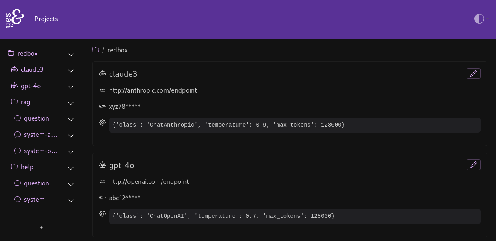
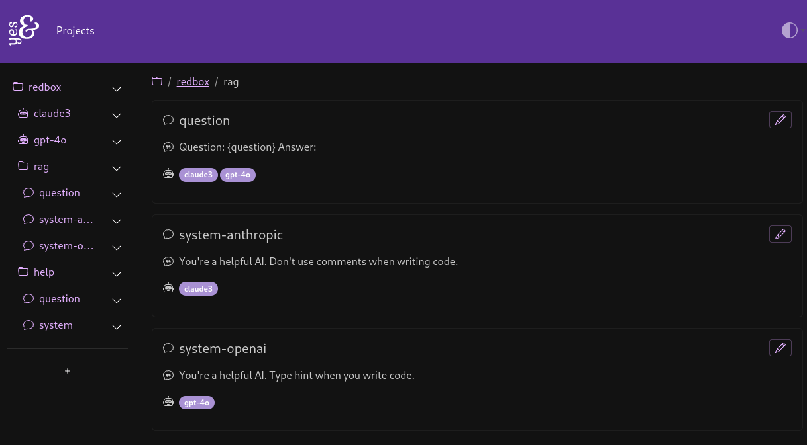

# 

A lightweight, minimal prompt database and webapp that aims to keep you creative.

## Philosophy

yes& wants to be simple to deploy, simple to work with, and simple to query. It's only ever opinionated enough to get you storing and serving your first prompt as quickly as possible.

* Minimal prompt storage overhead
* Flexible, enabling prompt organisation
* Serve prompts via API

## API

yes& allows you to structure your AI configurations and prompts in a directory tree where prompts can be assigned any AI in their ancestor tree. Because of the hierarchical design and focus on flexibility, we use [GraphQL](https://graphql.org) for our API.

Consider the following project, Redbox. We have two AI endpoints configured. 

Note that we can add any parameters we like in a valid JSON, allowing construction of anything from LangChain classes to your custom Haskell API wrapper for Cohere. The focus is on creativity and flexibility.



Sometimes we might want different system prompts for different AIs.



Get all AIs in the Redbox project: 

```console
curl -X POST http://localhost:8000/graphql/ \
     -H 'Content-Type: application/json' \
     -H 'Accept: application/json' \
     -d @- << 'EOF'
{
    "query": "{ 
        allAimodels(directory: \"redbox\") { 
            edges { 
                node { 
                    display 
                    endpoint 
                    parameters 
                    apiKey 
                }
            } 
        } 
    }"
}
EOF
```

Get all prompts with "system" in the name in the Redbox project: 

```console
curl -X POST http://localhost:8000/graphql/ \
     -H 'Content-Type: application/json' \
     -H 'Accept: application/json' \
     -d @- << 'EOF'
{
  "query": "{ 
        allPrompts(promptType: \"system\", directory: \"redbox\") {
            edges {
                node {
                    display
                    text
                    dirnode {
                        display
                    }
                }
            }
        }
    }"
}
EOF
```

Get all prompts marked for Claude:

```console
curl -X POST http://localhost:8000/graphql/ \
     -H 'Content-Type: application/json' \
     -H 'Accept: application/json' \
     -d @- << 'EOF'
{
    "query": "{ 
        allPrompts(aiModel: \"claude3\") {
            edges {
                node {
                    display
                    text
                    dirnode {
                        display
                    }
                }
            }
        }
    }"
}
EOF
```

Get Claude's system and question prompt for the Redbox project's RAG directory:

```console
curl -X POST http://localhost:8000/graphql/ \
     -H 'Content-Type: application/json' \
     -H 'Accept: application/json' \
     -d @- << 'EOF'
{
    "query": "{ 
        modelPrompts(modelName: \"claude3\", directory: \"rag\") {
            display
            text
            dirnode {
                display
            }
        }
    }"
}
EOF
```


## To do

- [ ] Add API key object to restrict API access to that directory or lower
- [ ] Add user model and authentication

## Development

This Django project is managed using [poetry](https://python-poetry.org), and is linted and formatted with [ruff](https://docs.astral.sh/ruff/).

Task running is done with [poethepoet](https://poethepoet.natn.io/index.html). Run `poe` to see what's implemented.

Currently themed with [Pulse](https://bootswatch.com/pulse/) from Bootswatch but that can change.
